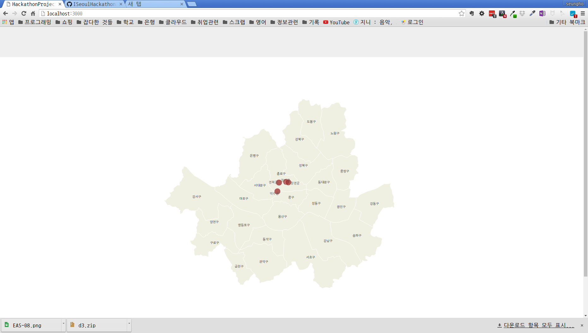
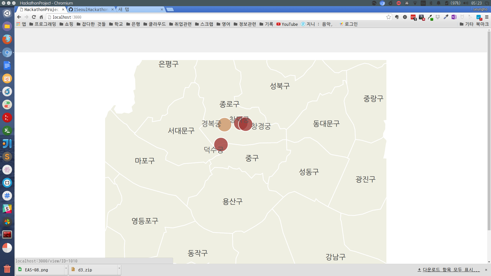
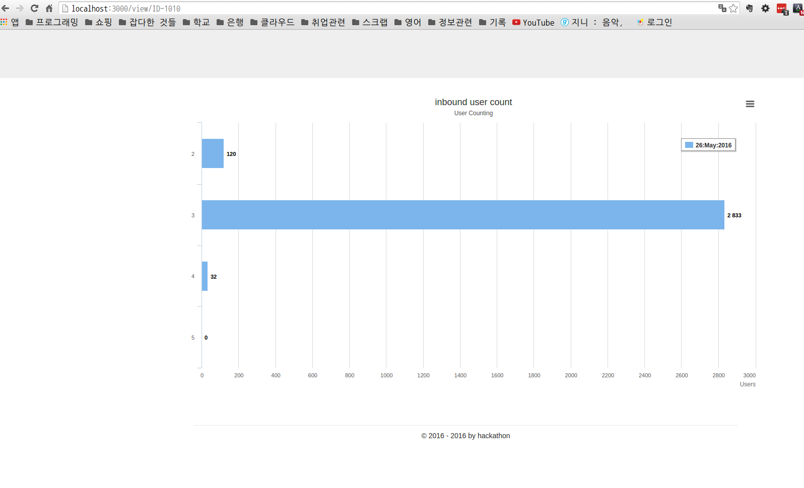
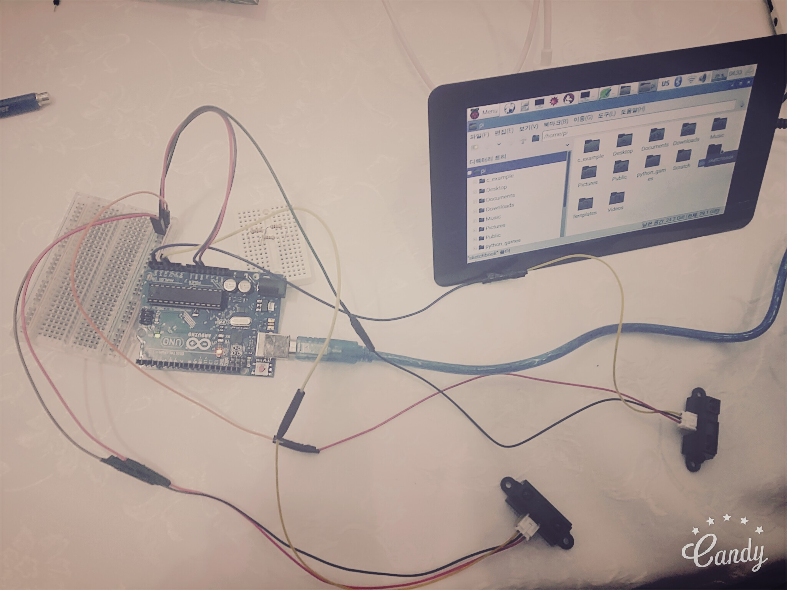
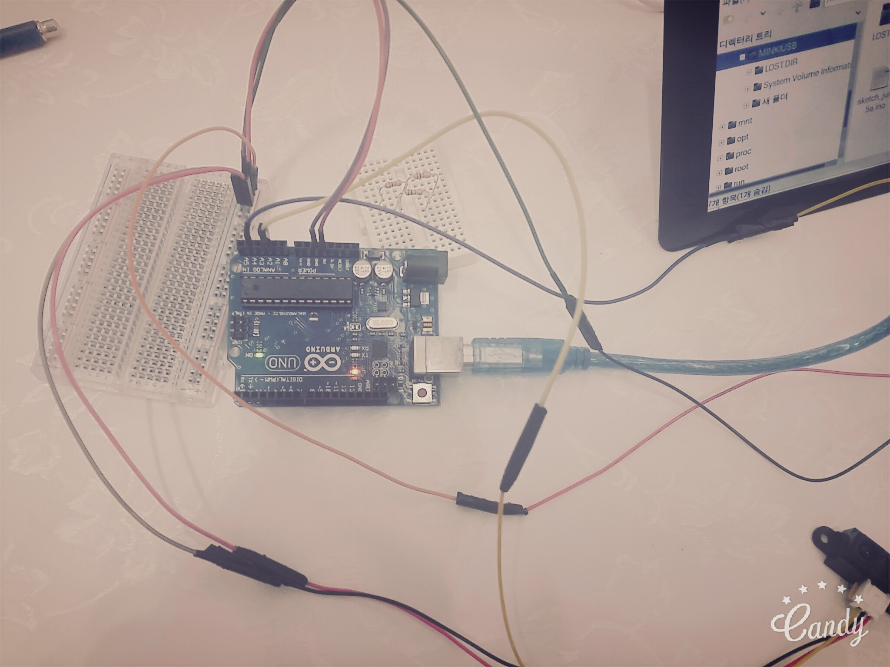
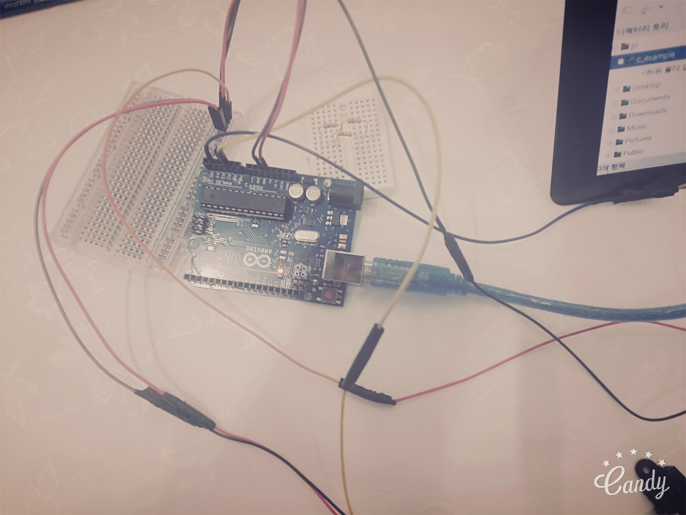
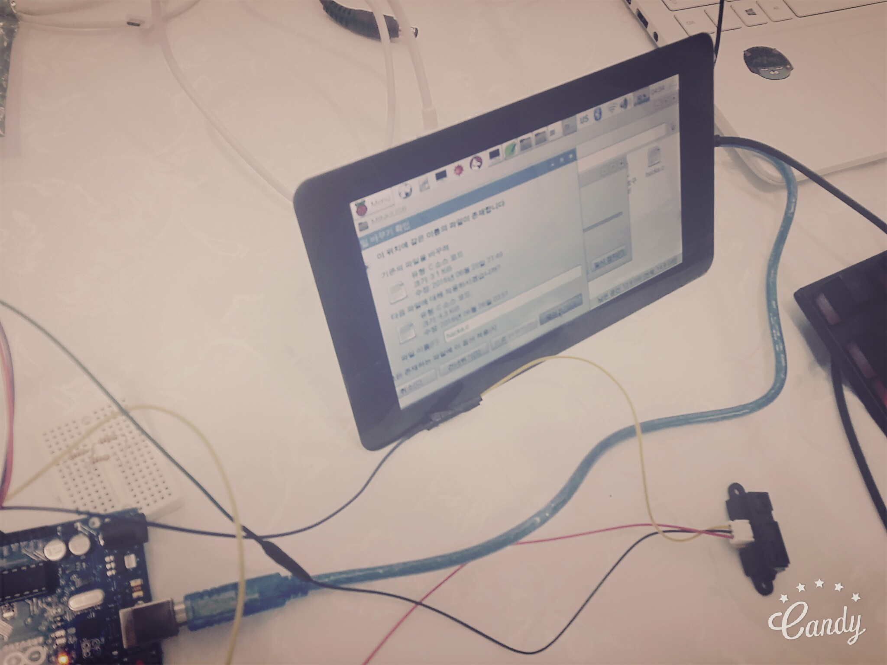

# This Project - I Love Seoul Hackathon project.

Data : 2016-06-25 ~ 2016-06-26

## 해당 프로젝트 명세 

1. 디바이스 장비로 사람이 지나가는 것을 인식 후 계수.
2. 저장된 계수 정보를 DB에 저장.

### 프로젝트 개요

서울시 주요 관광지에 대한 인원수를 파악 및 공유하는 서비스로 시간별 인원 파악을 통한 인원 분산을 통해 관광객들의 편의를 제공하고, 포화도를 웹/모바일을 통해 시각화하여 관광지역을 보다 편리하게 관광 할 수 있도록 하는데 초점을 두는 서비스입니다. 이 서비스를 제공 받는 대상이 서비스를 통해 한국의 주요 문화 관광지에 대해 편리한 환경을 제공하게 되므로 여행상의 편리성을 증가 시키는 데 목적을 두었습니다.

### 실제 기능

* 가장 대표 되는 프로토타입만 개발하는 것을 목표로 한다.

1. 아두이노와 적외선 센서 2개를 이용해 in/out를 구별한다.
2. 센서 데이터를 라즈베리파이가 받아서 DB에 저장한다.
3. 웹 서버를 이용해 DB에 있는 데이터를 시각화한다.

위 이미지는 웹 서버 초기 Index 페이지 입니다.

위 이미지는 지도에 대한 Zoom 기능 시연

위 이미지는 장소 데이터 중 클릭시 세부 페이지로 이동 되어 데이터를 시각화하여 보여줍니다.

- - -

### 장비 구조 이미지

---

참고  

* [seoul maps data](https://github.com/southkorea/seoul-maps)
* [d3 참고](https://www.lucypark.kr/blog/2015/06/24/seoul-matzip-mapping/)
* [d3 참고 - 마이크 보스톡](http://bl.ocks.org/mbostock)

