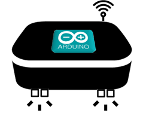
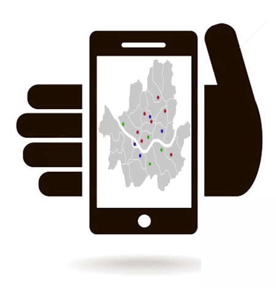
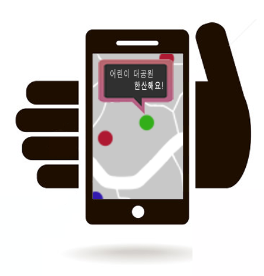
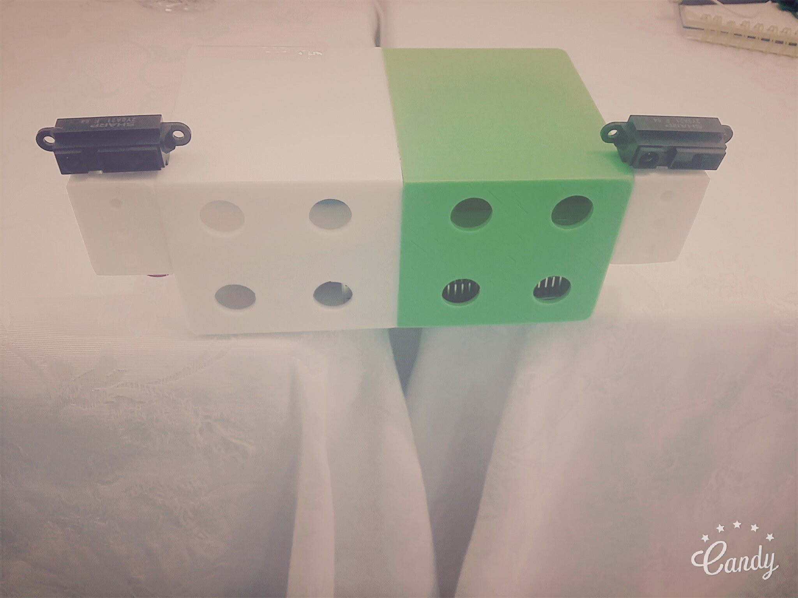
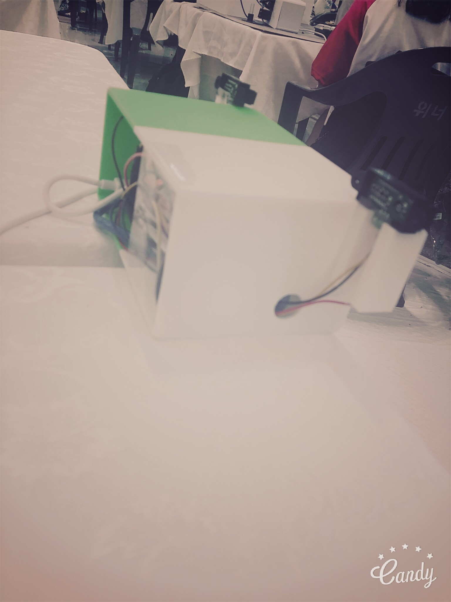
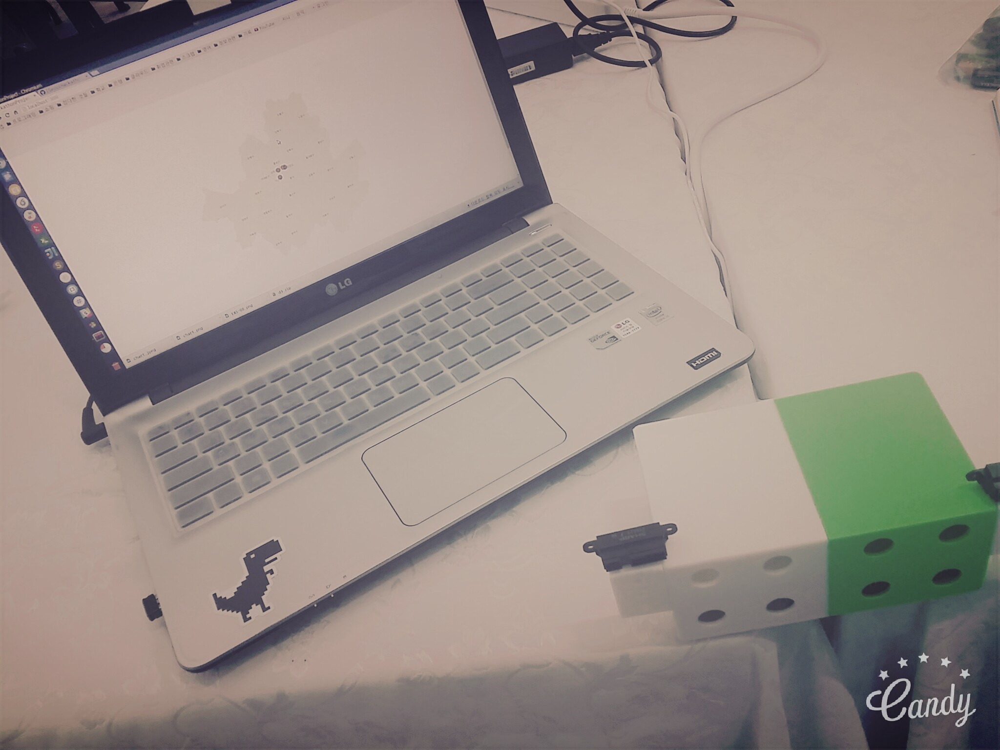
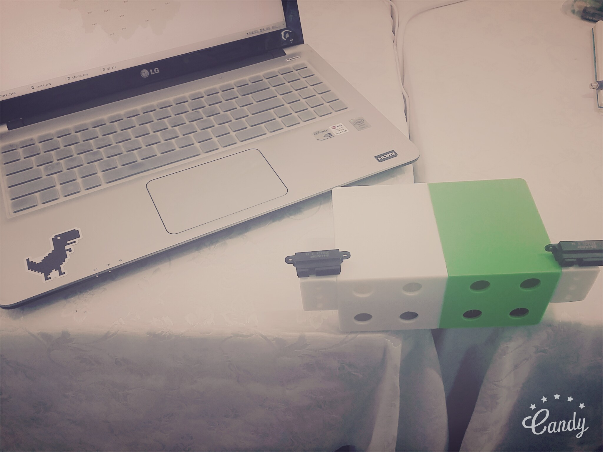

# This Project - I Love Seoul Hackathon project.

Data : 2016-06-25 ~ 2016-06-26

## 해당 프로젝트 명세 

1. 디바이스 장비로 사람이 지나가는 것을 인식 후 계수.
2. 저장된 계수 정보를 DB에 저장.

### 프로젝트 개요

서울시 주요 관광지에 대한 인원수를 파악 및 공유하는 서비스로 시간별 인원 파악을 통한 인원 분산을 통해 관광객들의 편의를 제공하고, 포화도를 웹/모바일을 통해 시각화하여 `관광지역을 보다 편리하게 관광` 할 수 있도록 하는데 초점을 두는 서비스입니다. 이 서비스를 제공 받는 대상이 서비스를 통해 한국의 주요 문화 관광지에 대해 편리한 환경을 제공하게 되므로 **여행상의 편리성을 증가** 시키는 데 목적을 두었습니다.

### 초기 구상

초기 구상때는 장비를 케이스에 넣는 것을 생각했었습니다.

웹에 처음 접근하면, 실시간으로 장비가 설치 된 곳을 보여줍니다.

모바일로도 확인이 가능합니다.

모바일에 터치시 알림 메시지를 이용해 포화도를 사용자에게 알려준다.

---

### 실제 기능

* 가장 대표 되는 프로토타입만 개발하는 것을 목표로 한다.

1. 아두이노와 적외선 센서 2개를 이용해 in/out를 구별한다.
2. 센서 데이터를 라즈베리파이가 받아서 DB에 저장한다.
3. 웹 서버를 이용해 DB에 있는 데이터를 시각화한다.

위 이미지는 웹 서버 초기 Index 페이지 입니다.

위 이미지는 지도에 대한 Zoom 기능 시연

위 이미지는 장소 데이터 중 클릭시 세부 페이지로 이동 되어 데이터를 시각화하여 보여줍니다.

- - -

### 장비 구조 이미지

---
### Final img

### 3D printing Case 추가

행사 내 40여대의 3D 프린터가 존재하여 케이스는 해당 행사에서 `스위처`의 직원분께서 모델링을 해주셨습니다.

##### 시간 제약때문에 최대한 빠른 시간내에 프린팅 하기 위해 절반으로 잘라 프린팅하였고, 이후 접착제로 부착하였습니다.

##### 기대 효과

많은 사람들이 몰리는 곳을 피할 수 있으며, 서버단을 RESTful API로 개발하여, 향후 모바일/웹 동시에 커버리지가 가능하며, 외국어 지원까지 한다면, 불편함을 덜 수 있는 서비스로 성장 할 수 있을 것입니다. 또한, 일별/주별/월별 레포트를 추가하고, 해당 지역 근방 축제 및 행사 관련 정보를 끌어와 동시에 정보를 게시할 수 있으면, 훨씬 더 정확한 서비스가 될 것이라 생각합니다. 

##### 개발 간 문제점

1. 두 적외선 센서의 인지 Threshold value가 달라 해당 문제점을 찾는데 시간이 걸렸다. (같은 부품이라 같은 성능일거라 확신한 탓)
2. D3의 미숙함으로 주요 기능을 보여주는데 꽤 오래 걸렸다. 
3. 뭐니 뭐니 해도 어설픈 디자인( 예쁜게 갑이다라는 팀의 철학을 살리지 못했습니다. )
4. 체력의 한계...

#### 개발 환경 

##### 장비

* 아두이노
* 라즈베리 파이
* 적외선 센서

DB Server 

* DigitalOcean - Ubuntu 14.04 MySQL Server 5.6

Back-End

* Ruby on Rails (local)
* 해당 프로젝트를 상용 클라우드에 올릴시 DB 연동 정보를 변경 해야 함.

Front-End

* Bootstrap
* D3
* HighCharts

### 심사위원분들의 조언

**적외선 센서는 가시광선에도 노이즈가 심하게 반응하니 적외선+초음파 센서가 결합된 부품을 쓰면 더 확실하다고 조언해 주셨습니다.**

---

참고  

* [seoul maps data](https://github.com/southkorea/seoul-maps)
* [d3 참고](https://www.lucypark.kr/blog/2015/06/24/seoul-matzip-mapping/)
* [d3 참고 - 마이크 보스톡](http://bl.ocks.org/mbostock)

---

### License

Apache v2.0
